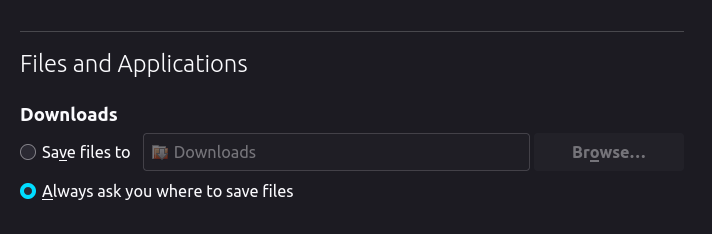

## Open Roberta Lab - Tutorial Editor

A Javascript based web application to create and edit tutorials for the [openroberta-lab](https://github.com/OpenRoberta/openroberta-lab).

### Prerequisites

This repo can be run standalone. As such, there are no prerequisites to be installed.
> When installing with the zip file, ensure that the name of the unzipped folder is `robertalab-tutorial-editor`!
 
In case a current installation of `openrobertalab_binaries` exists, download this repo such that the directory looks as follows:
```
.
├── ...
├── openrobertalab_binaries
└── robertalab-tutorial-editor
```

### Usage

#### Linux
To start the application, open a terminal window in the directory of the repo and run the following:
```shell
./start_linux.sh [-a | --admin-dir <admin-dir>] [-b | --browser <browser-name>] [-h | --help]
```
 
The application will search for `openrobertalab_binaries` in the same parent directory as this repo.
If not found, the latest release will be downloaded and unpacked instead.

By default, the application will print out the URLs for accessing the lab and tutorial editor, in case no parameters are provided.

#### Windows

To start the application, open a terminal window in the directory of the repo and run the following:
```shell
start_windows.bat [-admin-dir <admin-dir>] [-help]
```

The application will search for `openrobertalab_binaries` in the same parent directory as this repo.
If not found, the latest release will be downloaded and unpacked instead.

By default, the application will print out the URLs for accessing the lab and tutorial editor.

### Accessing the tutorial editor

Upon running the start script for the relevant OS, the server - and with it, the tutorial editor - will be started at:
- ORLab: http://localhost:1999/
- Tutorial editor: http://localhost:1999/tutorialEditor

### Viewing the tutorials

Once tutorials have been created in the application, click on the **Save** button. Viewing the tutorial involves certain steps on different browsers.
* Google Chrome/Microsoft Edge:
  * Navigate to the directory mentioned below. It is the default `admin-dir` location:
    * Linux: **/home/\<your-user\>/openroberta-tutorial/tutorial**. Eg:
      `/home/mmustermann/openroberta-tutorial/tutorial`
    * Windows: **\<your-home-drive\>\\<your-home-path\>\openroberta-tutorial\tutorial**. Eg:
      `C:\Users\mmustermann\openroberta-tutorial\tutorial`

    > In case a different `-admin-dir` parameter has been supplied to the start scripts, please navigate to that path instead.


  * Save the tutorial. Any valid name can be used.
  * Now the tutorial can be viewed in the browser. Simply refresh the already launched lab!
* Firefox:
  * Depending on the download folder, copy the downloaded tutorial json to the tutorial path mentioned above.
  * An alternative to always copying the downloaded tutorial to the correct path is to set the download folder explicitly or always be prompted to specify location: 
    
  * Now the tutorial can be viewed in the browser. Simply refresh the already launched lab!

### Compatible browsers

This application has been tested on Google Chrome, Microsoft Edge and Mozilla Firefox.
